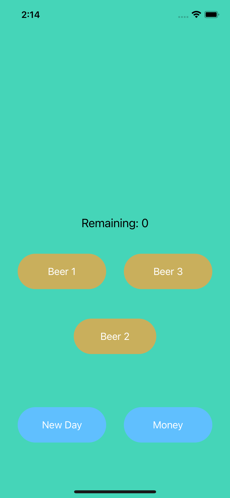
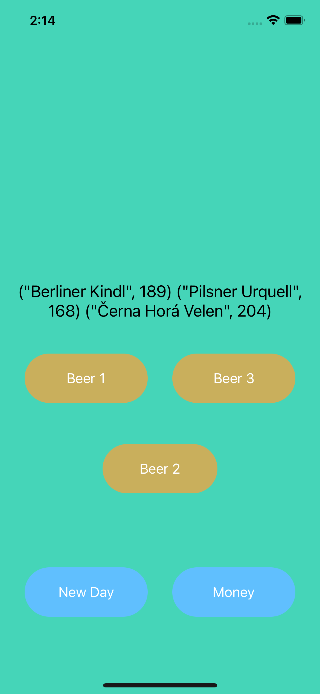
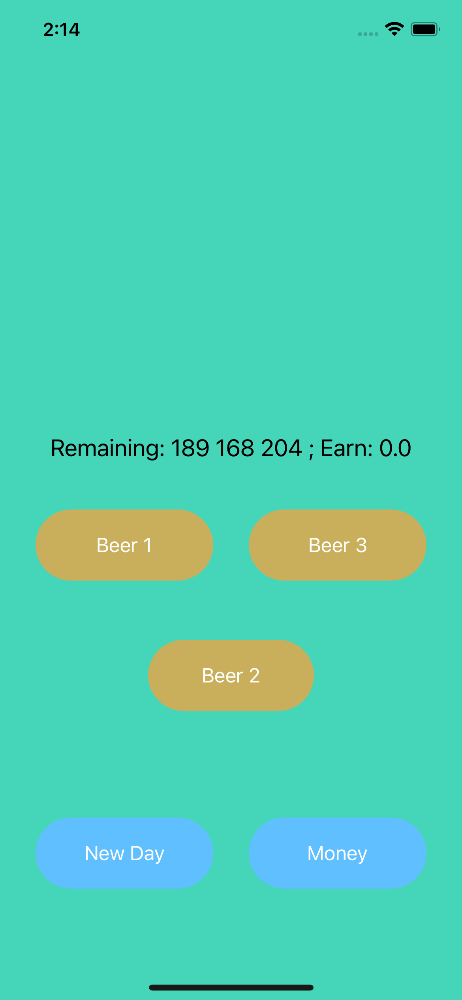
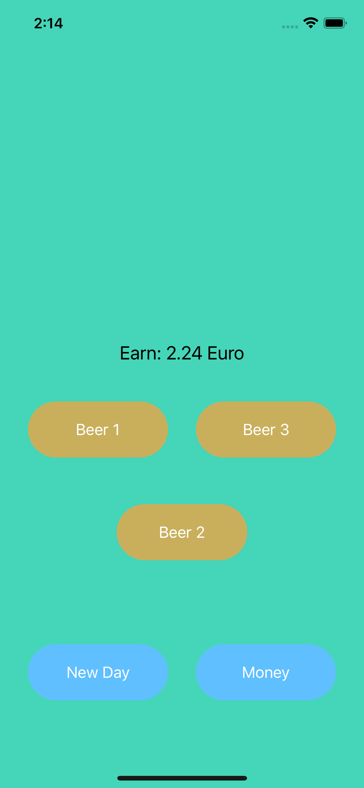

# Pub_Manager
This simple app will help you to calculate the number of different beer in the bar and earnings for the day.

## Features
You can add as many beers as you want. Only need to redo a little code and add new butttons.

## Main

## Remaining
By pressing one of the beer buttons, 1 bottle of a particular beer will be sold and the total balance of all beers will be shown on the screen.

## New Day
Pressing the "New Day" button will display the total balance of beer and the proceeds will be 0.

## Earn
Press the "Money" button to display the total amount of money of sold beer since the last time you pressed the "New Day" button.

